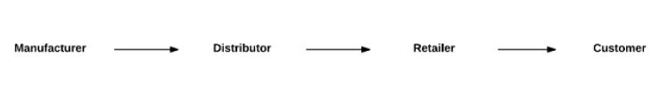

# Block-Track

A basic supply chain management system made with Hyperledger blockchain. 

## A basic product flow:

Manufacturer  -->  Distributor  -->  Retailer  -->  Customer

## Medium Articles:
Part-1: https://medium.com/coinmonks/building-a-blockchain-application-using-hyperledger-fabric-with-angular-frontend-part-1-f070bf169231
Part-2: https://medium.com/coinmonks/building-a-blockchain-application-using-hyperledger-fabric-with-angular-frontend-part-2-22ef7c77f53
Bug Fixes: https://medium.com/coinmonks/fixing-transaction-issue-in-angular-for-hyperledger-fabric-blockchain-application-fe7e28a7bb6e

